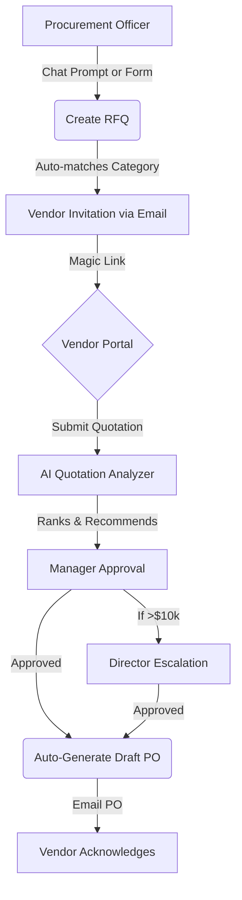

# 🏢 VendorBridge AI
**"Your AI Procurement Officer"**

[](https://nextjs.org/)
[](https://react.dev/)
[](https://www.typescriptlang.org/)
[](https://supabase.com/)
[](https://ai.google.dev/)
[](https://resend.com/)

VendorBridge AI is an intelligent procurement workflow application designed to automate and streamline RFQs, quotations, approvals, purchase orders, and vendor scoring. Instead of a simple database CRUD app, VendorBridge AI acts as an **AI Procurement Officer working 24/7**, analyzing vendor history, delivery performance, and market trends to tell you exactly who to buy from and why.

---

## ✨ Key Features

- 🤖 **AI Procurement Copilot**: A conversational interface powered by Gemini 2.5 Flash that parses natural language to create RFQs, compare quotes, and fetch analytics.
- 📊 **Dynamic Vendor Trust Score**: Automatically computes a 0-100 score for vendors based on price competitiveness, delivery performance, response speed, and dispute rates.
- ⚖️ **AI Quotation Analyzer**: Instantly compares multiple quotes, detects the best price and fastest delivery, and recommends the best overall value.
- 🚨 **Risk Detection Engine**: Real-time alerts for price spikes, vendor reliability drops, approval bottlenecks, and single-vendor dependencies.
- 🔄 **Automated Workflows**: Multi-tier dynamic approval routing (e.g., auto-escalating high-value requests >$10k) and automatic Purchase Order (PO) generation.
- 📈 **Procurement Command Center**: A sleek, dark-glassmorphism dashboard giving live visibility into active RFQs, spending trends, and risk alerts.

---

## 🏗️ Architecture & Workflow



---

## 💻 Tech Stack

- **Frontend**: Next.js 15 (App Router), React 19, Tailwind CSS (Custom Dark Glassmorphism Design)
- **Backend**: Next.js API Routes, Node.js
- **Database & Auth**: Supabase (PostgreSQL)
- **AI Engine**: `@google/genai` (Gemini 2.5 Flash)
- **Email Notifications**: Resend API
- **Data Validation**: Zod

---

## 🚀 Getting Started

### Prerequisites
- Node.js 18+
- [Supabase](https://supabase.com/) Account & Project
- [Google AI Studio](https://aistudio.google.com/) API Key (Gemini)
- [Resend](https://resend.com/) API Key (Optional, for real emails)

### 1. Installation

Clone the repository and install dependencies:
```bash
git clone https://github.com/Sakshi-2414/Odoo-x-KSV.git
cd Odoo-x-KSV
npm install
```

### 2. Environment Variables

Create a `.env.local` file in the root directory:

```env
# Public (client) Supabase values
NEXT_PUBLIC_SUPABASE_URL=https://your-project.supabase.co
NEXT_PUBLIC_SUPABASE_ANON_KEY=your_anon_key

# Server (admin) Supabase values - keep secret
SUPABASE_URL=https://your-project.supabase.co
SUPABASE_SERVICE_ROLE_KEY=your_service_role_key

# Google Gemini API Key
GEMINI_API_KEY=your_gemini_key

# Optional: Resend API Key (Will fallback to Mock Mode if missing)
RESEND_API_KEY=your_resend_key
```

### 3. Database Seeding

To quickly test the application, you can seed your Supabase database with dummy organizations, users, vendors, RFQs, and quotations.

*Ensure your `.env.local` is fully populated first.*

```bash
# Seed the database
npm run seed:supabase

# If you ever want to reset/remove the seeded data:
npm run cleanup:supabase
```

### 4. Start the Development Server

```bash
npm run dev
```
Navigate to `http://localhost:3000` to view the application.

---

## 📂 Project Structure

```text
.
├── app/                  # Next.js App Router (Routes, API endpoints)
│   ├── (auth)/           # Authentication (Login/Signup) 
│   ├── (dashboard)/      # Frontend Procurement Command Center
│   └── api/              # Backend endpoints (Approvals, POs, RFQs)
├── components/           # React UI Components (Dashboard, Shared, AI)
├── features/             # Core Domain & AI Logic
│   ├── ai/               # Gemini AI implementations (Copilot, Risk, Analyzer)
│   ├── notifications/    # Resend Email wrappers & Mock fallbacks
│   └── procurement/      # Business logic (PO workflows, Approvals, State integrity)
├── hooks/                # Custom React hooks
├── lib/                  # Shared utilities and Supabase clients
├── scripts/              # Database Seeding and Cleanup scripts
├── services/             # Direct Supabase Data Access Layer
└── types/                # TypeScript interfaces and Zod schemas
```

---

## 🛡️ Implementation Details

### Backend Business Logic
The core procurement workflows are fully implemented and automated in the `features/procurement/` directory to ensure data integrity across API routes:
- **Purchase Orders**: Auto-generates Draft POs upon quotation award and tracks vendor issuance metrics.
- **Approvals**: Dynamic multi-tier workflow routing. High-value requests automatically escalate, executing final business actions upon full approval.
- **Quotations**: Enforces state integrity (e.g., auto-rejecting competing quotes when a winner is chosen).

### AI Rate Limiting & Safety
The backend AI logic includes built-in retry mechanisms and exponential backoff to safely handle Free Tier API rate limits (15 RPM). AI functions strictly output validated JSON arrays.

---

*Built for the Odoo x KSV Hackathon 2026.*
