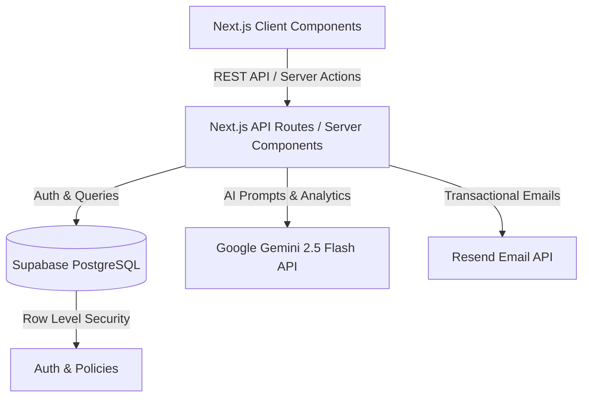

# System Architecture

VendorBridge AI uses a modern, serverless-first full-stack architecture built on Next.js 15, integrating heavily with Supabase for data and authentication, and Google's Gemini AI for intelligence.

## High-Level Architecture Diagram

## Tech Stack Overview

1. **Frontend Framework:** Next.js 15 (App Router)
2. **UI Library:** React 19 + Tailwind CSS + Lucide React
3. **Database & Authentication:** Supabase (PostgreSQL + GoTrue Auth)
4. **AI Engine:** `@google/genai` (Gemini 2.5 Flash)
5. **Email Provider:** Resend
6. **Deployment:** Vercel (Recommended)

## Data Layer (Supabase)

VendorBridge uses a highly relational PostgreSQL schema designed for strict auditability and rapid AI analytical querying:

- `users` and `organizations` for multi-tenant isolation.
- `rfqs` and `quotations` for procurement state.
- `vendors` and `vendor_analytics` for scoring & historical tracking.
- `approvals` for multi-stage workflow tracking.
- `purchase_orders` and `invoices` to complete the procurement loop.

**Security:** Row-Level Security (RLS) is strictly enforced for vendors (who can only see their own quotes) and scoped for internal organization members.

## API & Backend Design

The backend uses Next.js Route Handlers (`app/api/*`) for data mutations, combined with internal domain logic inside `features/`:
- `features/ai/`: Handles prompt engineering, schema validation (Zod), and Gemini integrations.
- `features/procurement/`: Manages state machine transitions for RFQs, PO generation, and Approval routing.

The application relies on HTTP cookies (`vend_auth`) synchronized with Supabase sessions to persist server-side authentication across Next.js Server Components.
